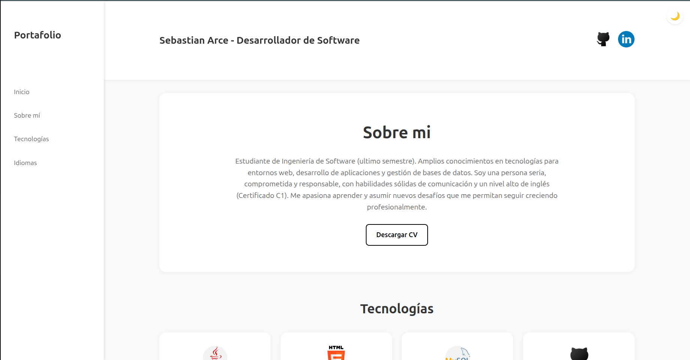

# 💼 Portafolio Web - Sebastian Arce

Este es mi portafolio personal como desarrollador de software. Aquí presento mi experiencia, habilidades técnicas, tecnologías dominadas y medios de contacto profesional.

## 🧑‍💻 Sobre mí

Soy estudiante de Ingeniería de Software en etapa final. Tengo conocimientos sólidos en desarrollo, bases de datos, y frameworks modernos. Me destaco por ser una persona comprometida, responsable y con un alto nivel de inglés (certificado C1).

## 🌐 Tecnologías

Entre las tecnologías que manejo, destacan:

- HTML5, CSS3, JavaScript
- TypeScript, Angular
- Python, FastAPI
- Java, Spring Boot
- MySQL, MongoDB
- Docker, Git, GitHub

## ✨ Funcionalidades

- Modo claro / oscuro con almacenamiento en local
- Diseño responsive para desktop y mobile
- Secciones: Sobre mí, Tecnologías, Idiomas, Contacto
- Botón para descargar CV
- Íconos sociales interactivos (GitHub, LinkedIn)

## 📸 Vista previa

## 🔗 Demo en vivo

[👉 Ver Portafolio en línea](https://www.linkedin.com/in/sebastian-arce29/)  

## 📬 Contacto

- Email: [sebastianarce@email.com](mailto:sebastianarce482@gmail.com)
- LinkedIn: [linkedin.com/in/sebastian-arce29](https://www.linkedin.com/in/sebastian-arce29/)
- GitHub: [github.com/sarce22](https://github.com/sarce22)

---

